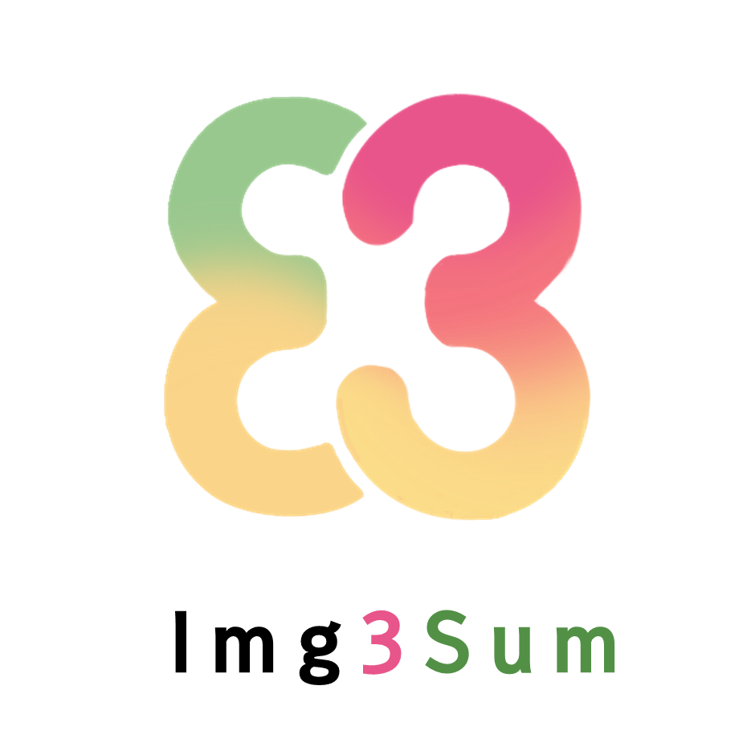

.. New Read The Docs documentation master file, created by
   sphinx-quickstart on Mon Sep 20 22:18:30 2021.
   You can adapt this file completely to your liking, but it should at least
   contain the root `toctree` directive.

Welcome to Img3Sum's documentation!
=============================================

 |License| |Python| |Flask|

.. |Python| image:: https://img.shields.io/badge/python-3670A0?style=for-the-badge&logo=python&logoColor=ffdd54
.. |License| image:: https://img.shields.io/crates/l/rustc-serialize?style=for-the-badge
.. |Flask| image:: https://img.shields.io/badge/flask-%23000.svg?style=for-the-badge&logo=flask&logoColor=white

Img3Sum is an Open-source project that supports translating, summarizing and converting images to text.

Introduction
============

The purpose of this tool is to organize text images into three lines for those who are not fluent with
English and who don't want to read the entire English document

Features
============

1. Optical character recognition of an image file with English text

2. Summarize extracted English text to 3 sentences 

3. Translate summarized English text to Korean

4. (planned) check for grammatical errors in extracted English text

5. (planned) Optical character recognition of an image file with Korean text

Demos
============

.. image:: images/Img3SumDemo.jpeg
   :width: 700
   :height: 450
   :align: center

Contents
============

.. toctree::
   :maxdepth: 2
   
   Installation/installguide
   HowToUse/howtouse
   Contribution/Contributing
   LICENSE

Release
=========

v 0.0.1

Authors
============

- Joonwon Jang
  - Github: `Lainshower <https://github.com/Lainshower>`_
- GeonYeong Son
  - Github : `GeonYeongSon <https://github.com/GeonYeongSon?tab=repositories>`_
- YiYoung Yoon
  - Github : `y20ng <https://github.com/y20ng?tab=repositories>`_
- JuHeon Oh
  - Github : `OZOOOOOH <https://github.com/OZOOOOOH>`_